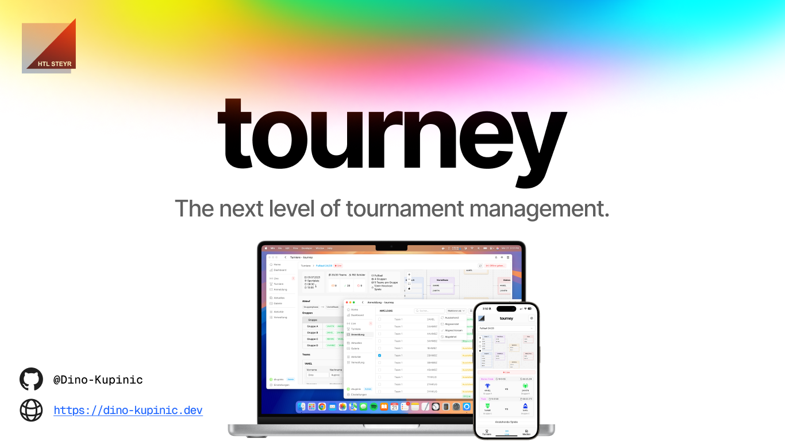

# tourney

Mono repository for the tourney project. This project is a web application for managing tournaments.

It includes an admin dashboard for managing tournaments, teams/players, live scores, and a client app for tournament
attendees.

> [!CAUTION]
> tourney is still in development. You will find bugs and broken/unfinished features.

## ♻️ Release Cycle

tourney follows the [Semantic Versioning](https://semver.org/) guidelines.

## ✨ Installation and Configuration

### Installation for Development

1. clone the repository:

```bash
git clone https://github.com/Dino-Kupinic/tourney.git
```

2. install packages

```bash
pnpm i
```

> [!TIP]
> If you don't have node.js installed, checkout https://nodejs.org to install for your operating system.
> We recommend using the LTS version, preferably v20 or higher.

> [!TIP]
> If you don't have pnpm installed, checkout https://pnpm.io/installation to install for your operating system.

### Backend

1. run supabase

```bash
pnpm run start:supabase
```

> [!TIP]
> If you don't have docker installed, checkout https://www.docker.com/.

2. head to http://127.0.0.1:54323

If it works, great!

### Frontends

#### Admin

1. define environment variables

Create a `.env` file and checkout the `.env.example`.
Copy the content into your `.env` and replace the following fields with your own.

| Field                    | Description                                            |
|--------------------------|--------------------------------------------------------|
| `SUPABASE_URL`           | URL to Supabase API                                    |
| `SUPABASE_KEY`           | Anon key                                               |
| `SUPABASE_SERVICE_KEY`   | Service Role Key                                       |
| `NUXT_PUBLIC_CLIENT_URL` | URL of the viewer app, default `http://localhost:3001` |

2. run dev server

```bash
pnpm run dev:admin
```

3. Head to http://localhost:3000/

If it works, great!

#### Viewer

1. define environment variables

Create a `.env` file and checkout the `.env.example`. Copy the content into your `.env` and replace the following fields

| Field          | Description         |
|----------------|---------------------|
| `SUPABASE_URL` | URL to Supabase API |
| `SUPABASE_KEY` | Anon key            |

2. run dev server

```bash
pnpm run dev:viewer
```

3. Head to http://localhost:3001/

If it works, great!

#### User creator script

1. define environment variables

Create a `.env` file and checkout the `.env.example`. Copy the content into your `.env` and replace the following fields

| Field             | Description                   |
|-------------------|-------------------------------|
| `SUPABASE_URL`    | URL to Supabase API           |
| `SUPABASE_KEY`    | Anon key                      |
| `USERS_TO_CREATE` | See comment in `.env.example` |

2. run the script

```bash
pnpm run create:users
```

If it works, great! You can now log in in the admin dashboard with the created users.

### Further Steps

#### Image Bucket

1. Create `images` bucket like below:

> [!NOTE]
> This step might be automated in the future.


2. Create the following folders in the `images` bucket:

- `logos`
- `variants`

3. Move the images from `/resources/base` to the `logos` folder in the bucket.
4. Move the images from `/resources/variants` to the `variants` folder in the bucket.
5. It should look like this:


*.svg logos in the logos folder*


*.svg logo variants grouped in the variants folder*

#### RLS Policies

1. Create the RLS policies:

- Read Access `SELECT`
  - on all tables for the `public` role
- Write Access `INSERT`
  - `class`, `registration`, `tournament` for the `authenticated` role
  - `player`, `team` for the `public` role
- Update Access `UPDATE`
  - `registration` for the `public` role
- Delete Access `DELETE`
  - `registration` for the `authenticated` role

> [!CAUTION]
> These policies are subject to change.
> Please refer to the latest documentation.

## 🧪 Testing

1. install playwright browsers

```bash
npx playwright install
```

// WIP

## 🚀 Deployment

1. build the app

```bash
pnpm run build
```

2. start the app

```bash
pnpm run app:start
```

> [!TIP]
> Didn't work?
> Try installing pm2 globally with `npm install pm2 -g`.

3. monitor the app

```bash
pnpm run app:monitor
```

4. enjoy the app!

// WIP

## 😄 Author

- [@Dino Kupinic](https://www.github.com/Dino-Kupinic)

## 🛠️ Tech Stack

- Nuxt 3
- Supabase (Postgres)
- Docker
- pm2

## Contributing

// WIP

## 😊 License

[MIT](https://choosealicense.com/licenses/mit/)
